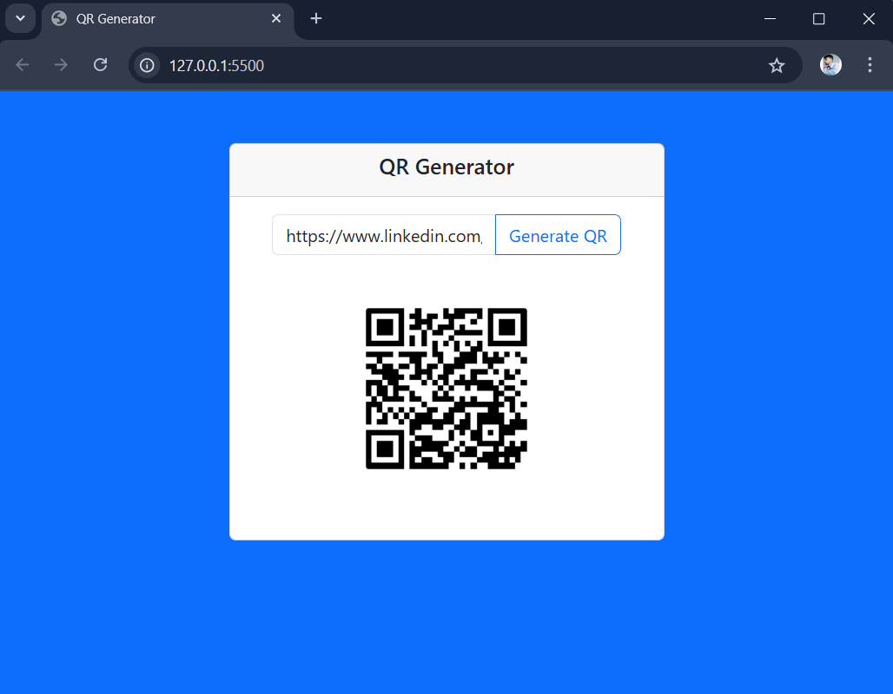

# QR Code Generator 🧾🔳

This is a simple web-based QR Code Generator built using **HTML**, **JavaScript**, and **Bootstrap 5**. It allows users to input any text or URL and generate a corresponding QR code using the [GoQR API](https://goqr.me/api/).

## 🔧 Features

- User-friendly interface with Bootstrap styling
- Input text or URL to generate a QR code
- Dynamically displays the generated QR code
- Validates empty input

## 🚀 How to Run

1. Clone or download the repository.
2. Open `index.html` in any modern web browser.

```bash
git clone https://github.com/your-username/qr-code-generator.git
cd qr-code-generator
open index.html
(No server setup is needed — it's a purely client-side project.)
```

## 📁 Project Structure

```bash
qr-code-generator/
├── index.html       # Main HTML file
├── style.css        # Custom CSS (optional)
└── README.md        # Project documentation
```

## 🌐 Technologies Used

- HTML5
- JavaScript
- Bootstrap 5
- [GoQR API](https://goqr.me/api/)

## 💡 Usage

1. Enter a text or URL in the input field.
2. Click the "Generate QR" button.
3. A QR code will be displayed below the input.

## 📷 Preview



Made with ❤️ for learning and sharing!


